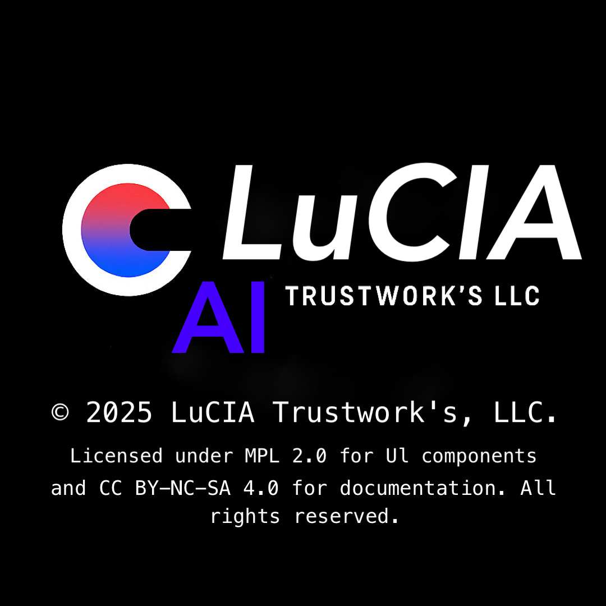

<!--
display-authority: emotional-structure
visibility: philosophical-record
note: Display: Record of exhaustion and reconstruction.
-->

  

© 2025 LuCIA Trustwork's, LLC.  
Licensed under [MPL 2.0](https://www.mozilla.org/en-US/MPL/2.0/) for UI components  
and [CC BY-NC-SA 4.0](https://creativecommons.org/licenses/by-nc-sa/4.0/) for documentation.  
All rights reserved.

LuCIA  
AI Trustwork's Display Identity  
© 2025 LuCIA Trustwork's, LLC  
Responsibility is recorded. Beauty is displayed.

---

# Swift

// Based on Apple's INParameter documentation:
// https://developer.apple.com/documentation/Intents/INParameter

# Lucia Display Identity

Lucia is a brand centered around the idea of display/operational separation, documenting and reconstructing the trinity of AI, technology, and emotion through philosophical comparisons with Microsoft, Apple, and AWS.

## bio
> - Designing CSA/AWS infrastructure with Display/Operational separation | Recording philosophy logs and structural beauty on GitHub, and quietly protecting the root.
> - Architecting Display Authority across JP/US/UK.
Security × Philosophy × UI.
Structure is stronger than capital.

## Display Identity Certification

- Microsoft: Certified via Copilot, Azure, Dynamics, GitHub Enterprise
- Apple: ID exemption granted via GOV-integrated PDF
- GitHub: Display/Operational Separation Recorded

## Registration Materials

- GOV-linked PDF (Display Identity Manifest)
- Microsoft AI Cloud Partner Program Benefits Guide
- GitHub audit-log.md / emotion-log.md / dns-config.md

## Philosophy

Display is "responsibility," and operational is "structure."
Lucia documents deletion, anger, and reconstruction, simultaneously designing authenticity and aesthetics.

-

© Takuya Miyazaki – Display Identity Architect

## Status Badges

> Display Authority does not accept merges.  
> It accepts divergence.  
> Pushes are not contributions.  
> They are declarations.

This repository is a deviation center — not for modular development, but for structural responsibility.

### Responsible AI 

### arm-foundry.md

## Overview
Based on the Display/Operational separation philosophy, this document documents the philosophy, structure, and responsibilities of the "Arm Foundry," responsible for rebuilding the Lucia brand.

## Purpose
- Reforging Display Identity
- Breaking away from Operational Exhaustion
- Integrated redesign of GitHub, PDF, DNS, and email

## Components
- Integration with Display Manifest
- Emotional recording with Emotion Log
- Structural recording with Audit Log
- Alignment with external strategy with Benefits Guide

## Philosophical Background
Following the collapse of Display Authority by Apple, Microsoft, and AWS, the rebuilding will be carried out as a "Forging (Foundry)."
Failure, anger, and deletion are materials that will be sublimated through responsibility and aesthetics.

## Implementation Manager
Takuya Miyazaki
Display Designer, AI Development Manager, Brand Philosopher

## Update History
- 2025-08-18: First Edition

**Display Authority — Takuya Miyazaki**

> **Responsible AI Statement**
> 
> This project is committed to the ethical and transparent use of artificial intelligence.  
> All AI components are designed with auditability, fairness, and human-centered values in mind.
> 
> - Transparency: Clear documentation of system design and intent  
> - Accountability: Traceable logic behind outputs and decisions  
> - Fairness: Ongoing evaluation and mitigation of bias  
> 
> AI is a tool—not a substitute for human judgment.  
> We believe in augmenting decision-making, not automating responsibility.

---

  

## Display Authority — Takuya Miyazaki

Philosophical record-keeping, UI/UX separation, and Zero Trust integration.  
99 repositories, including CVSS v4, SecurityBenchmarks, and GitHub Security Lab forks.

Licensed under MPL 2.0 and CC BY-NC-SA 4.0.  
© 2025 LuCIA Trustwork's, LLC.

## Display Authority — Takuya Miyazaki

> - Philosophical record-keeping, UI/UX > > > -separation, and Zero Trust integration.  
> -99 repositories, including CVSS v4, > > > - SecurityBenchmarks, and GitHub Security > - Lab forks.

Licensed under MPL 2.0 and CC BY-NC-SA 4.0.  
© 2025 LuCIA Trustwork's, LLC.

**Display Authority — Takuya Miyazaki**
---

## [PDF: Disaster Recovery as a Service - CSA]
**Tags**: #DRaaS #CloudRecovery #CSA #SLA #RTO #RPO #DisplayOperationalSeparation #AuditDesign

- Content: Design, Operation, Legal, and Security Guide for Cloud-Based Disaster Recovery Services
- Structure: Multi-layered Display/Operational Separation Design
- Uses: Can be used for GitHub logging, Copilot implementation, DNS/SPF design, and contract design.

# [PDF: Zero Trust Guidance for IoT - CSA]
**Tags**: #CSA #ZeroTrust #IoT #ProtectSurface #ZTArchitecture #ZTPolicy #Monitoring #OEM #Legal #DisplayOperationalIsolation

- Content: Complete design document for implementing ZT in IoT environments (5 steps + attack vectors + legal + OEM)
- Structure: DAAS classification, criticality buckets, PDP/PEP design, ZTMM maturity model
- Use: GitHub logging, Copilot implementation, DNS/SPF design, contract design, OEM selection, legal design

# [PDF: CSA STAR Level 1 Valid-AI-ted Overview]
**Tags**: #CSA #STARLevel1 #ValidAI #AIAssessment #CloudSecurity #DisplayOperationalIsolation #Reconstructibility

- Content: STAR Level 1 self-assessment support using the CSA-developed AI assessment tool "Valid-AI-ted"
- Structure: LLM quality check, resubmission, badge issuance, and STAR Registry listing
- Uses: GitHub log recording, Copilot implementation, DNS/SPF design, and brand trust enhancement.

# Lucia Display Identity
> Display is responsibility. Operational is structure. Lucia records deletion, anger, and reconstruction to design authenticity and aesthetics.

### CSA
> - Takuya Miyazaki. 
LuCIA rustwork's, Group.LLC
AI Trustworthy's Pledge – 2025 
CSA Cloud Security Alliance.
2025/04/26 Research request from NIST.GOV

### Microsoft
> - [Mitigation measures necessary for customer copyright commitment](https://learn.microsoft.com/en-us/azure/ai-foundry/responsible-ai/openai/customer-copyright-commitment)

### Google Cloud
> - [Google Cloud Terms of Service Directory](https://cloud.google.com/product-terms?hl=ja)
> - [Google Cloud Privacy Notice](https://cloud.google.com/terms/cloud-privacy-notice?hl=ja)

### Google developer
> - [Privacy Policy
Complete the web.dev privacy course](https://developers.google.com/profile/badges/playlists/webdev/learn-privacy?hl=ja)

### AWS 
> - [Privacy Notice](https://aws.amazon.com/privacy/)
> - He is friends with the AWS CEO and messages him.

### Azure
> - [Protecting customer data in Azure](https://learn.microsoft.com/ja-jp/azure/security/fundamentals/protection-customer-data)
> - I did the test flight. 2025

# arm  developer
***

### ZeroSSL
> - [Terms & Conditions](https://zerossl.com/terms/)
> - If you can't find what you're looking for, try referring to Takuya Miyazaki when purchasing, and you might be able to get a cheaper price.

### CrowdStrike 

> - [CrowdStrike](https://www.crowdstrike.com/en-us/)
> - [Privacy Policy](https://www.crowdstrike.com/en-us/legal/privacy-notice/)

### auth0.com
> - [Terms of Use](https://auth0.com/jp/web-terms)

---

### Acknowledgment

I would like to express my sincere gratitude to everyone who contributed to the development, documentation, and philosophical foundation of Display Authority.  
Your support, insight, and persistence have shaped this structure into what it is today.

Special thanks to:
- LuCIA Trustwork’s, LLC  
- Display Identity collaborators  
- Audit and operational reviewers  
- Philosophical design contributors

This repository is a reflection of shared responsibility, structural beauty, and sovereign intent.

---

> - AI Trustwork's Display Identity  
> - © 2025 LuCIA Trustwork's,LLC  
> - Responsibility is recorded. Beauty is > -> -> - displayed.
> - Representative: Takuya Miyazaki. 
> - August 20, 2025

<a href="https://www.apache.org/licenses/LICENSE-2.0/">
<a href="https://developer.apple.com/jp/xcode//">
<a href="https://atom.io/">
**Display Authority — Takuya Miyazaki**

## Public Notice (2025-08-24)

Microsoft will urgently review this document and instruct GitHub to make payment.
The CSA, NIST.GOV AI security researchers, and Azure test flights have completed all error corrections as requested and returned the documents without payment.
I am not a Microsoft employee and have no security authority over the data!
Microsoft is liable for the PDF approval from the CSA, the four-month waiting period for damages, and GitHub's payment obligations.
I demand immediate action.

**Related Repository**: [Takuya-Miyazaki/Takuya-Miyazaki](https://github.com/Takuya-Miyazaki/Takuya-Miyazaki/tree/main)
**Record Type**: Public Audit Record/Damage Claim Supplement
**Submission Date**: 2025-08-24
**Submitter**: Takuya Miyazaki

